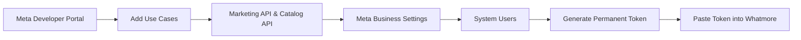
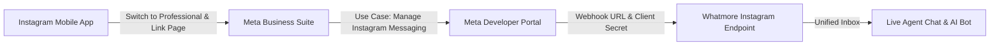

# Meta App Use Cases & Whatmore Integration Master Guide

This document provides a comprehensive breakdown of all Meta App Use Cases available in the Meta Developer Portal (`whatmore pixel` / Business ID: `1320250379153598`), explaining what each use case does, how it applies to Whatmore & Espon Clothing, what has already been built in our codebase, and exactly which permissions/use cases to enable.

---

## 1. Executive Summary & Quick Recommendation

In your Meta Developer App (**whatmore pixel**), select the following use cases:

| Priority | Category | Use Case Name | Purpose for Whatmore |
| :--- | :--- | :--- | :--- |
| 🔴 **CRITICAL** | **Business Messaging** | **Connect with customers through WhatsApp** | Powers WhatsApp Cloud API (Inbox, Broadcasts, Chatbots, Templates). *(If on this app)* |
| 🔴 **MUST-HAVE** | **Ads & Monetization** | **Create & manage ads with Marketing API** | Powers Meta Conversions API (CAPI) & Custom Audience sync for 12,000+ contacts. |
| 🟡 **HIGH** | **Ads & Monetization** | **Manage products with Catalog API** | WhatsApp Single Product Messages (SPM) and Multi-Product Catalog (MPM) sync. |
| 🟡 **HIGH** | **Ads & Monetization** | **Capture & manage ad leads with Marketing API** | Real-time webhook for Facebook/Instagram Instant Lead Forms -> Instant WhatsApp trigger. |
| 🟢 **FUTURE** | **Business Messaging** | **Manage messaging & content on Instagram** | Unified Inbox expansion: receive and reply to Instagram DMs inside Whatmore. |

---

## 2. Detailed Breakdown of All Meta App Use Cases

### Category A: Ads and Monetization (6 Use Cases)

#### 1. Create & manage ads with Marketing API
- **What Meta Says**: *"Create, manage and optimize ad campaigns across Meta technologies. Programmatically extend, stop or update ad campaigns and more."*
- **What It Does**: Provides programmatic access to Meta Ads Manager, Ad Accounts, Pixel Datasets, and Custom Audiences.
- **Why It Matters for Whatmore**:
  1. **Meta Conversions API (CAPI)**: When a WhatsApp chatbot or salesperson closes a lead or an order is confirmed, Whatmore sends a server-side event (`Purchase`, `Lead`, `AddToCart`) directly to your Meta Pixel.
  2. **Custom Audience Sync**: Whatmore can push segmented contacts (e.g. VIP customers, high-value buyers from your 12,000+ contacts) into Meta Ad Audiences for retargeting and lookalike ad campaigns.
- **Priority**: 🔴 **MUST-HAVE**

#### 2. Capture & manage ad leads with Marketing API
- **What Meta Says**: *"Give potential customers a quick and safe way to sign up to get info about your business or products."*
- **What It Does**: Provides access to Meta Lead Gen forms and real-time webhooks whenever a prospect submits their details on Facebook/Instagram Lead Ads.
- **Why It Matters for Whatmore**:
  - Automatically captures the lead name, phone number, and answers into Whatmore Contacts Directory.
  - Instantly triggers an automated WhatsApp greeting template or chatbot menu (e.g. *"Hi Amit, thank you for showing interest in Espon Clothing! Here is our catalog..."*).
- **Priority**: 🟡 **HIGH** (If running Meta Lead Ads)

#### 3. Manage products with Catalog API
- **What Meta Says**: *"Manage catalogs and the products you want to promote across Meta technologies."*
- **What It Does**: Direct API access to Meta Commerce Manager Product Catalogs.
- **Why It Matters for Whatmore**:
  - Whatmore has Shopify product & combo sync.
  - To send WhatsApp **Single Product Messages (SPM)** or **Multi-Product Messages (MPM)** with interactive "View on WhatsApp" shopping carts, the Meta Catalog must be linked to your WhatsApp Business Account.
- **Priority**: 🟡 **HIGH** (For WhatsApp E-Commerce Catalog)

#### 4. Create & manage ads with ads MCP server
- **What Meta Says**: *"Build AI agents that manage ads on behalf of advertisers using the ads MCP server."*
- **What It Does**: Meta's new Model Context Protocol (MCP) server for external AI tools to view/adjust ad campaigns.
- **Why It Matters for Whatmore**: An emerging standard. Not needed for our current WhatsApp CRM operations.
- **Priority**: ⚪ **LOW / NOT NEEDED**

#### 5. Create & manage app ads with Meta Ads Manager
- **What Meta Says**: *"Promote your mobile app and drive installs. Create and manage campaigns that encourage users to download and install your app."*
- **What It Does**: Tailored for native iOS and Android mobile apps listed on Apple App Store or Google Play Store.
- **Why It Matters for Whatmore**: Whatmore is a responsive web application and e-commerce platform, not a native app store download.
- **Priority**: ❌ **NOT NEEDED**

#### 6. Advertise on your app with Meta Audience Network
- **What Meta Says**: *"Join Meta Audience Network to monetize your app and grow revenue with ads from Meta advertisers."*
- **What It Does**: Displays third-party banner and video ads inside your app to earn ad revenue (similar to Google AdSense / AdMob).
- **Why It Matters for Whatmore**: Whatmore is your internal business CRM and commerce hub; you do not want third-party banner ads showing to your team or customers.
- **Priority**: ❌ **NOT NEEDED**

---

### Category B: Business Messaging (3 Use Cases)

#### 1. Connect with customers through WhatsApp
- **What Meta Says**: *"Start a WhatsApp conversation, send notifications, create ads that click-to-WhatsApp and provide support. Business portfolio required."*
- **What It Does**: Unlocks the WhatsApp Business Cloud API.
- **Why It Matters for Whatmore**:
  - **The core engine of Whatmore.**
  - Handles message sending, webhook ingestion, template approval sync, media messaging, interactive lists/buttons, and live chat.
- **Priority**: 🔴 **CRITICAL (Must-Have)**
  > *Note*: If your WhatsApp Cloud API was already configured under another Meta App, keep that active. If this app (`whatmore pixel`) is your primary app, this must be selected.

#### 2. Manage messaging & content on Instagram
- **What Meta Says**: *"Publish posts, share stories, respond to comments, answer direct messages and more with the Instagram API."*
- **What It Does**: API access to Instagram Business accounts for Direct Messages (DMs) and Story Mentions.
- **Why It Matters for Whatmore**:
  - Provides the path to a **Unified Inbox** inside Whatmore: agents can answer WhatsApp messages and Instagram DMs from the same screen.
- **Priority**: 🟡 **HIGH (Future Expansion)**

#### 3. Engage with customers on Messenger from Meta
- **What Meta Says**: *"Respond to messages sent to your business' Facebook Page. You can set up automatic replies or use a human agent to respond."*
- **What It Does**: Read and reply to Facebook Page Messenger chats.
- **Why It Matters for Whatmore**: Useful if customers message your Facebook Page directly.
- **Priority**: ⚪ **MEDIUM (Optional)**

---

### Category C: Content Management & Others (7 Use Cases)

| Use Case Name | Description | Whatmore Relevance | Priority |
| :--- | :--- | :--- | :--- |
| **Track engagement with Meta App Events** | SDK event tracking for mobile apps. | We use Meta Conversions API (CAPI) on the server side instead. | ⚪ **LOW** |
| **Manage everything on your Page** | Post to Facebook Page and moderate follower comments. | Only needed if building Facebook Page auto-comment moderation. | ⚪ **OPTIONAL** |
| **Access the Threads API** | Read and publish Threads posts. | Not relevant for WhatsApp CRM & sales. | ❌ **NOT NEEDED** |
| **Access the Live Video API** | Stream live video to Facebook. | Not relevant for WhatsApp CRM & sales. | ❌ **NOT NEEDED** |
| **Embed Facebook, Instagram content** | oEmbed API for embedding posts on websites. | Not relevant for WhatsApp CRM & sales. | ❌ **NOT NEEDED** |
| **Share or create fundraisers** | Charity and donation API. | Not applicable to commercial sales. | ❌ **NOT NEEDED** |

---

## 3. What Has Already Been Built in Whatmore (Inventory)

The following capabilities are already implemented and active in the Whatmore codebase:

### 1. WhatsApp Cloud API Infrastructure
- **Connected Account**: Live number `+91 74043 88242` with High Quality rating and 10,000 msgs/24h limit.
- **Meta Templates Hub**:
  - Fetches approved Meta templates in real-time.
  - Supports template creation with header media, dynamic variables `{{1}}`, quick reply buttons, and call-to-action buttons.
- **Unified WhatsApp Inbox**:
  - Two-way real-time messaging.
  - Multi-agent chat assignment (direct agent, team assignment, round-robin).
  - Internal customer notes, quick tags, quotations, and order attachments.
- **Visual Chatbot & Flow Builder**:
  - Drag-and-drop conversational nodes.
  - Interactive menus, buttons, dynamic product catalogs, and conditional branching.
  - Direct integration nodes for CRM leads, ERP, and Meta CAPI.
- **Broadcast Campaigns**:
  - Bulk audience messaging with scheduled delivery.
  - Delivery analytics: Sent, Delivered, Read, and Failed message counts.
- **WhatsApp Contacts Directory**:
  - Database stores 12,000+ customer records.
  - Server-side pagination (50 contacts per page) with quick page navigation.
  - Duplicate detection and smart merging based on clean phone keys.
  - Full-directory Excel export (up to 100,000 contacts).
  - Chunked Excel import with client-side progress bar and post-import team assignment.

### 2. Meta Conversions API (CAPI)
- **Active Node in Flow Engine** (`src/lib/whatsappFlowEngine.ts`):
  - When a user reaches a designated stage in a chatbot flow or an order is created, Whatmore sends a server-side event to your Meta Pixel (`1386264563245511`).
  - Automatically hashes customer phone and email with SHA-256 for Meta privacy compliance.
  - Endpoint `test-meta-capi` is available to verify event delivery directly into Meta Events Manager.

### 3. Meta Custom Audience Sync
- **Dedicated Endpoint** (`src/app/api/whatsapp/meta-custom-audience/route.ts`):
  - Allows exporting segmented contacts by tags or purchase history directly into a Meta Ad Account Custom Audience for retargeting campaigns.

### 4. Commerce & Shopify Catalog
- Products and Shopify combos synced in the PostgreSQL database.
- Ready for WhatsApp Single Product Messages (SPM) and Multi-Product Messages (MPM).

---

## 4. Step-by-Step Action Plan in Meta Developer Portal

To obtain a permanent, secure Access Token for your Whatmore features:



### Step 1: Add Selected Use Cases in the Modal
1. Under **Ads and monetization**, check:
   - `[x]` **Create & manage ads with Marketing API**
   - `[x]` **Manage products with Catalog API**
   - `[x]` **Capture & manage ad leads with Marketing API** *(if running lead forms)*
2. Under **Business messaging**, check:
   - `[x]` **Connect with customers through WhatsApp** *(if this app manages your WhatsApp number)*
   - `[x]` **Manage messaging & content on Instagram** *(optional, for future IG Inbox)*
3. Click the blue **Save** button in the bottom-right corner.

### Step 2: Generate a Permanent System User Token (Never Expires)
> [!IMPORTANT]
> Do NOT use temporary tokens from the Graph API Explorer (they expire in 1–24 hours). Always create a **System User Token** in Meta Business Manager.

1. Open **Meta Business Suite / Business Settings** (`business.facebook.com/settings`).
2. Go to **Users** -> **System Users**.
3. If not already created, click **Add** to create an Admin System User (e.g. `Whatmore System Admin`).
4. Click **Add Assets**:
   - Assign your **WhatsApp Business Account** with full control.
   - Assign your **Pixel / Dataset** with full control.
   - Assign your **Catalog** with full control.
   - Assign your **Ad Account** with manage campaigns permission.
5. Click **Generate New Token**:
   - Select your App: **whatmore pixel**.
   - Set Token Expiration: **Never**.
   - Select the required permissions:
     - `whatsapp_business_management`
     - `whatsapp_business_messaging`
     - `ads_management`
     - `ads_read`
     - `catalog_management`
     - `leads_retrieval`
6. Click **Generate Token** and copy the generated `EAA...` string.

### Step 3: Configure Token in Whatmore Platform
1. Log in to your Whatmore Dashboard (`whatsapp.esponsports.com`).
2. Navigate to **WhatsApp Hub** -> **Integrations** (or **Settings**).
3. Under **Meta Conversions API (CAPI)**:
   - Ensure the Pixel ID is set to `1386264563245511`.
   - Paste the System User Token into the **Access Token** field.
4. Click **Save & Test Connection**.

---

## 5. WhatsApp Webhook Fields Configuration (31 Subscribed, calls & message_echoes OFF)

In the Meta App (`whatmore pixel`), under **Connect on WhatsApp** -> **Configuration**, 31 WhatsApp webhook fields are Subscribed. Both `calls` and `message_echoes` are kept **Unsubscribed / OFF** (cleaner setup; calls logic removed from codebase, and message_echoes is restricted/unneeded).

A dedicated field-by-field guide has been compiled in:
👉 **[WHATSAPP_WEBHOOK_FIELDS_GUIDE.md](file:///c:/Users/HP/Desktop/whatsapp-app/WHATSAPP_WEBHOOK_FIELDS_GUIDE.md)**

### Quick Summary of Webhook Processing:
1. **Already Active in Production (`src/app/api/whatsapp/webhook/route.ts`)**:
   - `messages`: Complete 2-way chat routing, media, button/list selections, delivery receipts (`sent`, `delivered`, `read`, `failed`).
   - `message_template_status_update`: Real-time template approval/rejection alerts + admin push notifications.
   - `flows`: Interactive Meta Flows decryption and payload handling.
   - Raw logs: 100% of all other events saved in `whatsAppWebhookLog`.

2. **Key Monitoring Events**:
   - `phone_number_quality_update`: Alerts if number health drops from Green to Yellow/Red.
   - `account_alerts`: Meta policy warnings and tier notices.
   - `template_category_update`: Alerts if Meta re-categorizes a template (e.g. Utility -> Marketing).

---

## 6. Instagram Messaging API: Step-by-Step Setup Guide

Instagram Direct Messaging allows Whatmore to receive customer DMs, Story mentions, and quick reply postbacks directly in the unified agent inbox alongside WhatsApp.



### Step 1: Prepare Instagram Professional Account
1. Open the **Instagram mobile app** on your phone.
2. Go to **Settings & Privacy** -> **Account Type & Tools** -> **Switch to Professional Account** (choose either *Business* or *Creator*).
3. Connect your Instagram account to your Facebook Business Page:
   - In **Meta Business Suite** (`business.facebook.com`), navigate to **Settings** -> **Linked Accounts** -> **Instagram**.
   - Click **Connect Account** and log in with your Instagram credentials.
4. **CRITICAL STEP: Enable Messages Access**:
   - In the Instagram mobile app: Go to **Settings** -> **Messages and story replies** -> **Message controls**.
   - Under **Connected tools**, toggle **Allow access to messages** to **ON**. *(If this is OFF, Meta will silently drop incoming DMs without webhook delivery).*

### Step 2: Configure Instagram Use Case & Webhook in Meta Developer Portal
1. Open [Meta Developer Portal](https://developers.facebook.com) and select your App (**whatmore pixel**).
2. Go to **Use Cases** -> Find **Manage messaging & content on Instagram** -> Click **Customize** (or Add).
3. Under **Instagram API setup**, scroll to **3. Configure webhooks**:
   - **Callback URL**: 
     - *Client Dedicated URL*: `https://whatsapp.esponsports.com/api/instagram/webhook/<CLIENT_WEBHOOK_ID>`
     - *Universal Fallback URL*: `https://whatsapp.esponsports.com/api/instagram/webhook`
   - **Verify Token**:
     - *Client Dedicated Secret*: `espon_ig_<FIRST_8_CHARS_OF_CLIENT_ID>` (Auto-generated per client)
     - *Universal Secret*: `espon_instagram_secure_token_2026`
4. Click **Verify and save**.
5. Under **Subscriptions**, click **Subscribe** to the following fields:
   - `[x]` `messages` (Incoming user DMs, text, images, voice notes)
   - `[x]` `messaging_postbacks` (Button clicks, quick replies)
   - `[x]` `message_deliveries` (Delivery receipts)
   - `[x]` `message_reads` (Seen/Read receipts)
   - `[x]` `message_reactions` (Emoji reactions to messages)

### Step 3: Generate Permanent System User Access Token
1. Go to [Meta Business Settings -> System Users](https://business.facebook.com/settings/system-users).
2. Select your Admin System User -> Click **Generate New Token**.
3. Select App: **whatmore pixel**.
4. Set Token Expiration: **Never**.
5. Check the following permissions:
   - `instagram_basic`
   - `instagram_manage_messages`
   - `pages_show_list`
   - `pages_manage_metadata`
   - `pages_read_engagement`
6. Click **Generate Token** and copy the permanent `EAA...` string.

### Step 4: Configure & Test in Whatmore Platform
1. Log in to Whatmore -> Go to **Settings & Integrations** -> Click the **Instagram API** tab.
2. Enter:
   - **Instagram Business Account ID**: e.g. `1784140012345678` (Found in Meta Business Suite or via Graph API `/me/accounts`).
   - **Permanent Access Token**: The `EAA...` System User Token generated in Step 3.
3. Click **Save Instagram Credentials**.
4. Click **Test Connection** — Whatmore verifies live connectivity against Meta Graph API and displays your verified account name.

---

## 7. Facebook Messenger API: Step-by-Step Setup Guide

Facebook Messenger allows Whatmore to receive customer chats from your Facebook Business Page in real-time.

### Step 1: Add Messenger Product in Meta Developer Portal
1. Open [Meta Developer Portal](https://developers.facebook.com) and select your App (**whatmore pixel**).
2. In the left navigation, click **Use Cases** (or **Add Product**).
3. Select **Engage with customers on Messenger from Meta** (or **Messenger**).

### Step 2: Configure Messenger Webhooks
1. In the Messenger configuration screen, find the **Webhooks** card.
2. Click **Add Callback URL**:
   - **Callback URL**:
     - *Client Dedicated URL*: `https://whatsapp.esponsports.com/api/facebook/webhook/<CLIENT_WEBHOOK_ID>`
     - *Universal Fallback URL*: `https://whatsapp.esponsports.com/api/facebook/webhook`
   - **Verify Token**:
     - *Client Dedicated Secret*: `espon_fb_<FIRST_8_CHARS_OF_CLIENT_ID>` (Auto-generated per client)
     - *Universal Secret*: `espon_facebook_secure_token_2026`
3. Click **Verify and Save**.
4. Under **Webhooks**, select your Facebook Business Page from the dropdown and click **Subscribe**:
   - `[x]` `messages`
   - `[x]` `messaging_postbacks`
   - `[x]` `message_deliveries`
   - `[x]` `message_reads`

### Step 3: Generate Permanent Page Access Token
1. In Meta Business Settings -> System Users (or Messenger Access Token section):
   - Select your Facebook Page.
   - Ensure permissions: `pages_messaging`, `pages_show_list`, `pages_manage_metadata`.
   - Generate a permanent Page Access Token.
2. Note down your **Facebook Page ID** (Found in Facebook Page -> *About* -> *Page Transparency*).

### Step 4: Configure & Test in Whatmore Platform
1. Log in to Whatmore -> Go to **Settings & Integrations** -> Click the **Facebook Messenger** tab.
2. Enter your **Facebook Page ID** and **Page Access Token**.
3. Click **Save Messenger Credentials**.
4. Click **Test Connection** — Whatmore verifies live connectivity against Meta Graph API.

---

## 8. Multi-Client Differentiation Architecture

To ensure that multiple organizations, clients, or branches can operate simultaneously without messages ever mixing between tenants:

```
Meta Webhook Event
       │
       ├── Case 1: URL contains Client ID ────► /api/{channel}/webhook/[clientId] ────► Matched directly by URL path
       │
       ├── Case 2: Verify Token has Client Secret ─► espon_{channel}_{shortId} ────────► Matched to Client in DB
       │
       └── Case 3: Event contains Recipient ID ──► recipient.id (IG/Page ID) ────────► Matched to WhatsAppIntegration in DB
```

1. **Client-Dedicated Webhook URLs**:
   - WhatsApp: `/api/whatsapp/webhook/[clientId]`
   - Instagram: `/api/instagram/webhook/[clientId]`
   - Facebook: `/api/facebook/webhook/[clientId]`
2. **Client-Unique Verification Secrets**:
   - Each client generates a distinct verify secret automatically based on their unique `webhookClientId`:
     - WhatsApp: `wm_<first_8_chars>`
     - Instagram: `espon_ig_<first_8_chars>`
     - Facebook: `espon_fb_<first_8_chars>`
3. **Payload-Level Recipient Matching**:
   - Every incoming Meta event contains the `recipient.id` (Page ID or Instagram Account ID).
   - Our webhook processors query the database to tag the event with the exact client / tenant ID, completely isolating conversations, contacts, and logs.

